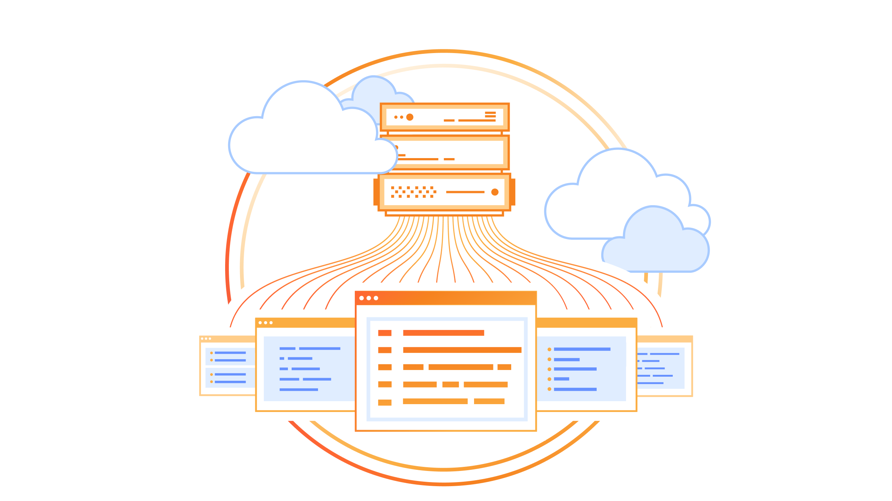

# Cloudflare: Improving Internet Speed and Security

## Introduction

In the digital era, website security and performance have become essential in providing users with a seamless online experience. A technology that's leading the way in improving speed and security is Cloudflare. As a website owner, developer, or business operator, learning how Cloudflare works and why it matters can provide you with a competitive advantage.

## What is Cloudflare?

Cloudflare is a worldwide content delivery network (CDN), security system, and DNS service that makes websites and web applications faster, safer, and more reliable. Cloudflare was established in 2009 and has since become one of the world's largest networks, serving millions of requests per second for websites, APIs, and applications.

In plain terms, Cloudflare is a middle layer between your site server and your visitors, caching content for delivery, filtering malicious traffic, and keeping your site online.

## Cloudflare Features

### DNS Management

Cloudflare is a high-performance and solid DNS (Domain Name System) management service that works as a key element in routing user traffic to your site.

- **Global Network**: Runs on more than 300 data centers around the globe, providing fast DNS resolution.
- **DDoS-Resilient**: Designed to survive high-volume attacks, keeping your domain available.
- **User-Friendly Interface**: Easily manage DNS records with an easy-to-use dashboard.

### Caching

Cloudflare's caching feature helps to save bandwidth and improve load times by storing copies of your website's static content on its global network.

- **Efficient Caching**: Automatically caches static content, reducing the need for repeated requests to your origin server.
- **Customizable Rules**: Set custom caching rules to control what content gets cached and for how long.
- **Bandwidth Reduction**: Significantly reduces bandwidth usage by serving cached content to users.

### Cloudflare Tunnels

Cloudflare Tunnels offer a secure way to expose your local applications or servers to the internet without the need to open inbound ports. By creating an outbound connection to Cloudflare's network, these tunnels keep your services safe from outside threats.

- **Secure Exposure**: Publish internal applications securely without exposing them to the internet directly.
- **Simplified Access**: Avoid complicated VPN configurations.
- **Integration with Load Balancing**: Integrate tunnels with Cloudflare's Load Balancing to distribute traffic effectively across multiple origins, including private IPs.

### Load Balancing

For optimal performance and reliability, Cloudflare Load Balancing routes traffic to several servers or data centers.

- **Global Traffic Management**: Sends users to the closest or healthiest server, cutting down on latency and avoiding overloads.
- **Health Monitoring**: Periodically monitors the health of your servers, routing traffic away from any that fail to respond.
- **Integration with Security Services**: Easily integrates with Cloudflare's DDoS protection, Web Application Firewall (WAF), and Bot Management to protect your services.

### DDoS Protection

Distributed Denial-of-Service (DDoS) attacks have the potential to cripple internet services. Cloudflare's DDoS Protection is intended to identify and mitigate these threats in real-time.

- **End-to-End Coverage**: Shields against layer 3, 4, and 7 OSI model layer-based attacks.
- **Automated Mitigation**: Detects and incapacitates threats without human intervention.
- **Scaleable Defense**: Utilizes Cloudflare's extensive network capability to absorb and deflect large-scale attacks.

### Bot Management

Malicious bots can cause data breaches, content scraping, and other security risks. Cloudflare's Bot Management separates legitimate visitors from malicious bots, offering powerful protection.

- **Advanced Detection**: Employs machine learning, behavioral examination, and fingerprinting to properly detect bots.
- **Customizable Responses**: Block, challenge, or rate-limit dubious traffic according to your unique needs.
- **Improved User Experience**: Keeps disruptions to actual users to a minimum by cutting down on reliance on CAPTCHAs.

### Web Application Firewall (WAF)

Cloudflare's Web Application Firewall (WAF) protects your website from common vulnerabilities and attacks by filtering and monitoring HTTP traffic.

- **Comprehensive Protection**: Shields against SQL injection, cross-site scripting (XSS), and other common threats.
- **Custom Rules**: Create custom rules to meet your specific security needs.
- **Real-Time Updates**: Continuously updated to protect against the latest threats.

### SSL/TLS Encryption

Cloudflare provides free SSL certificates, ensuring encrypted connections between your website and its visitors.

- **Automatic HTTPS**: Automatically redirects HTTP traffic to HTTPS, ensuring secure connections.
- **Flexible SSL Options**: Offers various SSL/TLS configurations to suit different security needs.
- **Improved SEO**: Enhances search engine rankings by enabling HTTPS.

### Content Delivery Network (CDN)

Cloudflare's CDN distributes your website’s content across a global network of data centers, ensuring faster load times for visitors by serving content from the nearest server.

- **Global Reach**: Delivers content from over 300 data centers worldwide.
- **Reduced Latency**: Minimizes latency by caching content closer to users.
- **Bandwidth Savings**: Reduces bandwidth usage by serving cached content.

## Advantages of Using Cloudflare

- **Improved Website Performance**
- **Enhanced Security**
- **Improved Reliability**
- **Cost Savings**
- **Easy Integration**

## How to Set Up Cloudflare for Your Website

### 1. Sign Up for a Cloudflare Account
- **Visit Cloudflare's Website**: Go to the sign-up page of Cloudflare.
- **Create Your Account**: Provide your email address and choose a secure password.

### 2. Add Your Website to Cloudflare
- **Initiate the Process**: Log in and click on "Add a Site."
- **Enter Domain Name**: Type in your website's domain (e.g., www.example.com) and click "Add Site."

### 3. Select a Cloudflare Plan
- **Choose a Plan**: Review the available plans—Free, Pro, Business, and Enterprise—and select the one that aligns with your website’s needs.

### 4. Review and Configure DNS Records
- **Automatic DNS Scan**: Cloudflare will scan and import your existing DNS records.
- **Verify Records**: Ensure all records are accurate. Add or modify records as necessary to match your current hosting setup.

### 5. Update Your Domain’s Nameservers
- **Obtain Cloudflare Nameservers**: Cloudflare will provide specific nameserver addresses for your domain.
- **Access Domain Registrar**: Enter your domain registrar's account (where you registered your domain).
- **Replace Nameservers**: Overwrite the nameservers with Cloudflare's ones. This updates traffic to come through Cloudflare's network.

### 6. Let DNS Propagation
- **Wait Period**: The DNS changes generally propagate in 24 to 48 hours. Your website continues to be reachable during this duration.

### 7. Set Up Extra Cloudflare Options
- **Access the Dashboard**: After propagation is finished, go to your domain's Cloudflare dashboard.
- **Improve Security and Performance**:
  - **SSL/TLS**: Activate SSL to secure data between your server and visitors.
  - **Page Rules**: Configure rules to manage caching, redirects, and more.
  - **Firewall**: Set up security options to block malicious traffic.

## Conclusion

Whether you’re launching a new website or managing a high-traffic application, Cloudflare can play a critical role in improving speed, security, and reliability. With its global infrastructure, smart traffic routing, and powerful security tools, Cloudflare helps websites perform better while staying safe from modern cyber threats.
